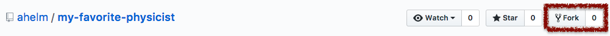
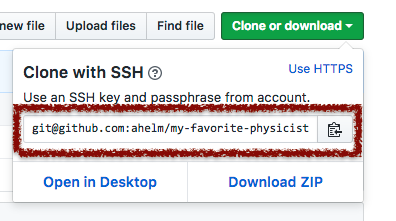

# My favorite physicists

Status: 

This is a small demo example project meant as an introduction to help physicists
work with git/github. It is designed to write a small article including a
sections of famous physicists. Most of the resources are taken from
[wikipedia](https://www.wikipedia.org). This repository is meant as a small
supplement to a presentation and introduction session.

## How to contribute to the projects

Consider the steps below as an example how to work with a project on github.

1. Take this repository and create a fork.

    

2. Clone the forked repository to your computer. Using the command
  `git clone <similar_address_as_below>`. This will create a directory with
  the projects name. Be aware that the user name will be changed as you will be
  cloning your fork instead.

    

    _Note: If you want to clone using SSH follow [this instructions](https://help.github.com/articles/connecting-to-github-with-ssh/)
    to add ssh keys to github._

3. On your local machine go to the cloned directory and create a new branch by
  using `git checkout -b <branch_name>`. Use a meaningful name for the branch.
4. Edit the file `my-favorite-physicist.tex` and the corresponding subfiles.
5. Check if it is compiling and working properly and then commit the changes
  using `git add <changed_file>` to track the modified files. Add a commit by
  using `git commit` which should open an editor for you. __Remember: First
  line (max 80 characters) is used as a commit heading - make this short and
  describe your changes extensively below. Better describe more than less.__
6. Now you can push the changes to github using `git push -u origin <the_name_of_branch>`.
7. Go to your fork and create a pull request. You can add figures and additional
  informations to your pull request, e.g. your motivation behind your changes.
8. Wait :watch: until your pull request will be accepted.
